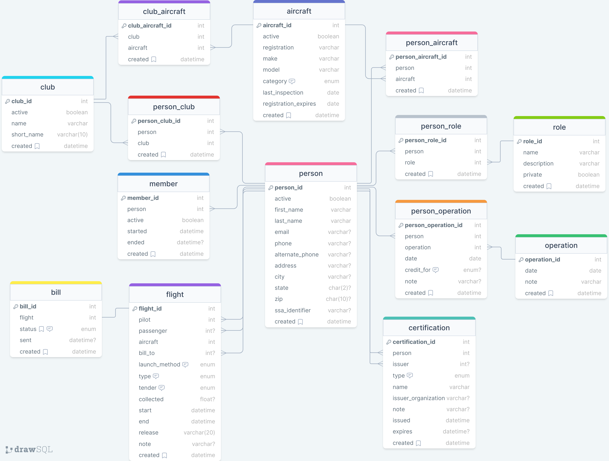

## Source

📦 View the source code on [GitHub](https://github.com/snowboardit/fsa-db/tree/master).

## Philosophy

The **Franconia Soaring Database** serves as the backbone for the management and billing system of the Franconia Soaring club, aiming to replace the current Google Sheets solution with a more customizable and efficient system. While it also supports the Franconia Soaring Foundation (FSF), the database design is tailored to cater to the requirements and workflows of Franconia Soaring Association (FSA).

The table structure and relationships within the database are designed to be familiar to club members who are accustomed to using the existing Google Sheets system. To illustrate the design philosophy, let's consider an example we are familiar with: weekend sign-up. In this scenario, a `person` who is a member of the `club` can sign up for an `operation` scheduled for July 2nd, 2023. Additionally, a `person` who holds the `role` of Duty Officer can also sign up for the same `operation`. See the different parts come together and organize a weekend operation? (If not, take a look at the [diagram](#diagram) and [table breakdown](#tables) below)

Given that Franconia Soaring is a people-centric operation, the database's design emphasizes the interconnectedness of individuals, their roles, and their participation in specific operations. By capturing these relationships, the database enables efficient tracking of member involvement and facilitates smooth coordination of club activities. This approach ensures that the database accommodates the unique requirements of the Franconia Soaring club, enhancing operational effectiveness and streamlining the billing process.

---

## Diagram

> See all database details [here](https://drawsql.app/teams/maxs-team-18/diagrams/fsa-db).

Please see the [tables](#tables) section below for a more in-depth and accurate representation of the database structure and relationships.

---

## Tables

`person`

The **person** table represents individuals associated with the FSA or FSF. It serves as a central repository for storing information about Franconia Soaring members, pilots, passengers, and other personnel involved in the organizations activities.

`flights`

The **flights** table stores information related to flight records within the FSA. It captures details about individual flights and its model takes after the flight log that currently exists in Google Sheets. It will log FSA club flights, as well as rides and visiting clubs’ flights. 

`aircraft`

The **aircraft** table in the FSA Database contains information related to the aircrafts utilized at Franconia airport. These can be aircraft owned by FSA, another **club** or a **person**.

`members`

The **members** table represents the membership information of individuals associated with the FSA or FSF. It stores details about club members, including their membership status, start and end dates, and other related information. Remember, not all **people** are **members**, but all **members** are **people.**

`certifications`

The **certifications** table contains information about certifications held by individuals associated with the FSA or FSF. In this model, ‘Certifications’ is used with broad meaning, representing many club-related certifications in addition to the aviation definition.

`clubs`

The **clubs** table stores information about the Franconia Soaring club, neighboring clubs such as Post Mills, GBSC, or any others.

`roles`

The **Roles** table represents the roles or positions that a **person** can hold within the FSA or FSF. Roles have the ability to be private, making it so a users roles can be displayed in a UI, yet hide sensitive roles like admin or billing admin to those who don’t need that information. 

`operations`

The **operations** table records information about operations conducted by the FSA. Operations can have a date in the past, present, or future. An operation and its related members (flights, person_operations) are related by date. This is to paint a picture of who did what on a specific operating day or in a timeframe.

`billing`

The **billing** table tracks billing information for flights within the FSA. It stores details about the flight, including the flight ID, creation date, billing status, and whether the billing information has been sent to QuickBooks.

This makes up about half of the system to achieve a more efficient billing process. The other half I imagine to consist of two main parts:

1. **UI**: When a new flight is entered through the UI, a row is automatically created in the billing table with a `pending` status. We can also achieve this with a database trigger.

2. **Service**: A program runs indefinitely and checks the `bill` table every `x` minutes for flights with the `pending` status. If there are items that match that criteria, the program will gather data required to invoice the individual, then attempts to send that data to QuickBooks. If data is sent to QuickBooks successfully, the system then sets the bill status to `sent`.

Defining a reasonable interval between each system check of the bill table for `pending` status records will be necessary, as this will allow a billing admin enough time to find and mark the bill as `cancelled`. In contrast, if the interval was, for example 1 minute, that would not allow the billing admin to mark the bill as `cancelled` prior to it being sent to QuickBooks.

> **NOTE:** To establish a connection to QuickBooks, use of an API and a service-specific key will be required.

`person_operations`

The **person_operations** table represents the sign-up records of individuals for specific operations or days with soaring operations.

`person_clubs`

The **person_clubs** table establishes the relationship between individuals and the clubs they are affiliated with.

`person_roles`

The **person_roles** table establishes the relationship between individuals and the roles they hold within the FSA or FSF.

`person_aircraft`

The **person_aircraft** table establishes the relationship between individuals and the aircraft they are associated with.

`club_aircraft`

The **club_aircraft** table establishes the relationship between clubs and the aircraft they have access to or own.

